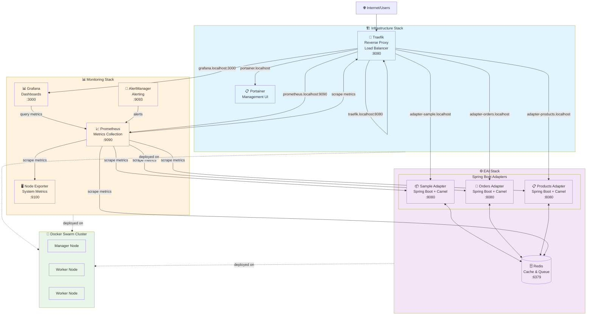

# EAI Docker Swarm Architecture



## Key Features

- **Service Discovery**: Automatic via Traefik labels
- **Load Balancing**: Traefik distributes traffic across replicas
- **Health Monitoring**: All services expose `/actuator/health` endpoints
- **Metrics Collection**: Prometheus scrapes `/actuator/prometheus` endpoints
- **Horizontal Scaling**: Stateless adapters can be scaled independently
- **Environment-driven Config**: No config files, all via environment variables

## Access URLs

- Traefik Dashboard: `http://traefik.localhost:8080`
- Portainer: `http://portainer.localhost`
- Prometheus: `http://prometheus.localhost:9090`
- Grafana: `http://grafana.localhost:3000` (admin/admin)
- Sample Adapter: `http://adapter-sample.localhost`
- Orders Adapter: `http://adapter-orders.localhost`
- Products Adapter: `http://adapter-products.localhost`
```